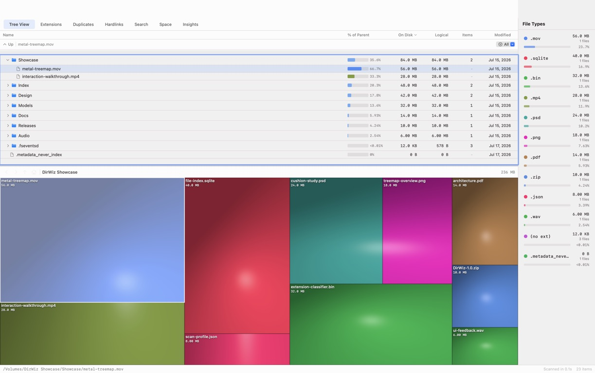

# DirWiz

macOS disk usage analyzer with a Metal cushion treemap, fast filesystem scans, duplicate detection, hardlink analysis, and a scriptable CLI.

<p align="center">
  
</p>




<p align="center"><em>A real DirWiz scan of a synthetic showcase volume: the selected file stays synchronized across the sortable tree, Metal treemap, path bar, and extension legend.</em></p>

## What It Does

DirWiz scans a volume or folder and builds a compact file tree using on-disk sizes, not just logical file lengths. The app is built for large local volumes where Finder size calculation is too slow or too shallow.

The main UI combines a WinDirStat-style treemap, a sortable file tree, extension breakdowns, search, duplicate groups, hardlink groups, and space insights. Full Disk Access is detected at launch, with clear guidance when macOS privacy permissions will hide files.

## Features

- **Fast scanner**: Uses bulk filesystem metadata reads, bounded worker pools, compact node storage, and deferred tree materialization for large scans.
- **Warm start**: Rescanning a volume with an unchanged-since-last-time cache loads the saved tree and patches only what an FSEvents journal replay says changed, instead of a full enumeration. Falls back to a normal cold scan automatically on any doubt; "Full Rescan" always forces cold.
- **Deferred bundle sizing**: App bundles stay as opaque leaves during the first scan so the UI becomes usable sooner. Bundle sizes are resolved in the background and propagated into parent totals.
- **Metal cushion treemap**: Shows disk usage visually with extension-based color mapping, zoom, selection, and hover details.
- **Sortable tree table**: Browse folders and files by on-disk size, logical size, item count, modified date, and parent percentage.
- **Duplicate finder**: Groups candidate files by size and hashes, then verifies byte-for-byte before any cleanup action.
- **Hardlink analysis**: Finds files that share inode identity and reports extra linked bytes for analysis. These bytes are not the same as reclaimable duplicate space.
- **Space insights**: Breaks usage into categories, file ages, size distributions, iCloud status, APFS clone checks, and local snapshot information.
- **Quick Look and Finder actions**: Preview files, reveal them in Finder, copy paths, or move selected items to Trash.
- **CLI**: `dirwiz-cli` supports scripted scans, JSON export, duplicate checks, volume info, and benchmark runs.

## Build

```bash
open Package.swift
swift build -c release
swift test
```

Build a release app bundle:

```bash
./scripts/package-release.sh
open dist/DirWiz.app
```

The package script creates `dist/DirWiz.app` and `dist/DirWiz-<version>-macos.zip` (version read from `Info.plist`).

### Published v1.0.0 artifact

The [v1.0.0 download](https://github.com/okturan/dirwiz/releases/tag/v1.0.0) is a historical Apple-silicon (`arm64`) build for macOS 15 or newer. It is ad-hoc signed, not notarized, and therefore may require an explicit Gatekeeper override on first launch. Its SHA-256 checksum is:

```text
763351f50f3087720b537914f6edbd91f238e01179a011d6f0d9d4036730fe4b  DirWiz-1.0.0-macos.zip
```

Verify a download before opening it:

```bash
shasum -a 256 DirWiz-1.0.0-macos.zip
```

Current source has moved beyond that artifact: `scripts/package-release.sh` now requires a universal `arm64` + `x86_64` binary and supports Developer ID signing plus notarization when the maintainer supplies Apple credentials. Those improvements do not retroactively make the v1.0.0 zip universal or notarized; Intel users should build current source until a newer verified release is published.

Run the CLI:

```bash
.build/release/dirwiz-cli scan /path/to/scan
.build/release/dirwiz-cli scan /path/to/scan --json --max-depth 3
.build/release/dirwiz-cli scan /path/to/scan -q
.build/release/dirwiz-cli duplicates /path/to/scan --min-size 1048576
.build/release/dirwiz-cli info /path/to/scan
.build/release/dirwiz-cli snapshot /path/to/scan
.build/release/dirwiz-cli diff /path/to/scan
.build/release/dirwiz-cli benchmark /path/to/scan --iterations 3
```

## Full Disk Access

macOS restricts many user and system folders unless the app has Full Disk Access.

For complete scans:

1. Build the app with `./scripts/package-release.sh`.
2. Move `dist/DirWiz.app` to `/Applications/DirWiz.app`.
3. Open System Settings.
4. Go to Privacy & Security, then Full Disk Access.
5. Add or enable DirWiz from `/Applications`.

Use the same installed app bundle after granting permission. Do not grant Full Disk Access to `.build/release/DirWiz`; SwiftPM rebuilds are raw executables and macOS may treat each rebuilt binary as a different app.

This Mac release script signs with a local Apple signing identity when one is available. If none is installed, it falls back to ad hoc signing. Ad hoc builds can lose Full Disk Access after rebuilds because macOS ties privacy grants to code identity.

## Architecture

```text
Sources/
├── DirWizCore/   Scanner, FileTree, duplicate detection, hardlinks, diff, export, analysis
├── DirWizUI/     AppState, SwiftUI views, Metal treemap, Quick Look, navigation
DirWiz/           macOS app target
CLI/              dirwiz-cli target
Tests/            Scanner, tree, duplicate, hardlink, treemap, analysis, and UI-state tests
```

## Scanner Notes

DirWiz stores scan results in a flat array tree with a shared string pool. This keeps parent and child references stable by index and avoids per-node object overhead on large scans.

The app path favors quick first results. It skips inline recursive sizing for bundles, renders the tree, then computes bundle sizes as a bounded background task. The CLI defaults to exact inline bundle sizing unless `DIRWIZ_SKIP_BUNDLE_SIZES=1` is set.

The app also builds the tree live during a cold scan (immediate materialization): the treemap and tree table fill in as directories are scanned instead of appearing all at once at the end. The CLI scans deferred by default (nodes accumulate off to the side and the tree is installed in one shot at the end) since it has no live view to fill in. `DIRWIZ_DEFER_TREE` overrides either default explicitly — `0` forces immediate, anything else forces deferred — so it doubles as the app's instant rollback to the old all-at-once behavior if immediate mode ever misbehaves on an exotic volume.

After a scan completes, the app saves the tree to a small on-disk cache keyed by the scanned root path. The next time you scan that same volume, if the cache is still valid it replays the FSEvents journal since the cache was saved, patches just the directories that actually changed, and republishes the tree in a fraction of the time a full scan would take. Anything that makes the replay untrustworthy — a poisoned journal (e.g. the volume was unmounted, or too much changed to enumerate cheaply), a stale/corrupt cache, or a changed path that can't be resolved — falls back to an ordinary cold scan automatically; nothing about the cold path changes. Use the "Full Rescan" button next to "Scan Volume" to bypass the cache and force a cold scan on demand (shown only when a cache exists), or set `DIRWIZ_NO_WARM_START=1` to disable warm start entirely. This is app-only; the CLI's `scan` subcommand always scans cold.

Useful scan toggles:

```bash
DIRWIZ_SCAN_WORKERS=6
DIRWIZ_DEFER_TREE=1   # app: force deferred (default is immediate); CLI: force immediate (default is deferred)
DIRWIZ_SKIP_BUNDLE_SIZES=1
DIRWIZ_BUNDLE_WORKERS=4
DIRWIZ_BULK_BUFFER_BYTES=262144
DIRWIZ_NO_WARM_START=1
```

Release script knobs (see `scripts/package-release.sh`):

```bash
DIRWIZ_DIST_DIR=/path/to/output
DIRWIZ_CODESIGN_IDENTITY="Developer ID Application: ..."
```

Advanced: `DIRWIZ_APP_SUPPORT_DIR` overrides where `snapshot`/`diff` persist saved snapshots (defaults to Application Support); mainly useful for tests and sandboxed runs.

## Requirements

- macOS 15 or newer
- Swift 6 toolchain
- Xcode command line tools
